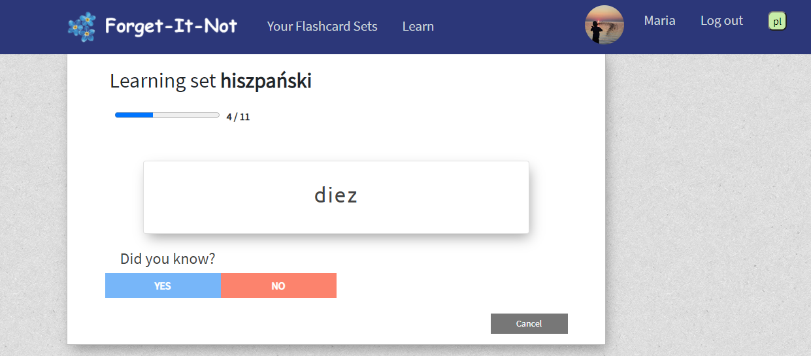

# Forget-It-Not
Simple django app for learning vocabulary by creating sets of flashcards and learning them.


## Table of contents
* [General info](#general-info)
* [Features](#features)
* [Technologies](#technologies)
* [Screenshots](#screenshots)
* [Installation and Setup](#installation-and-setup)
* [License and contact](#license-and-contact)

## General info
This is my first django app, its purpose for me was to learn django.

It is a simple application designed for learning languages and repeating new words.


## Features
* User registration with email confirmation
* Creating sets of flashcards (in question-answer format)
* Filtering flashcards by date
* Search bar to look for a specific flashcard 
* Learning all flashcards, flashcards from one set or from filtered part


## Technologies
* Python 3.8.0
* Django 3.0
* Bootstrap 4

## Screenshots





## Installation and Setup
Install Python 3.8 from https://www.python.org/downloads/  
Install git from https://git-scm.com/downloads 

Clone the repository:
```
git clone https://github.com/AgnieszkaPlatek/Forget_It_Not.git
cd Forget_It_Not
```
Create virtual environment:
```
python -m venv FIN_env
```
Activate the virtual environment on Windows / Linux:
```
FIN_env\Scripts\activate  /  source FIN_env/bin/activate
```
Install requirements:
```
pip install -r requirements.txt
```
Edit email configurations in settings.py (necessary for confirming registration):
```
EMAIL_HOST = 'smtp.gmail.com'
EMAIL_PORT = 587
EMAIL_USE_TLS = True
EMAIL_HOST_USER = '<your-email>'
EMAIL_HOST_PASSWORD = '<your-email-password>'
```
Run migrations and server:
```
python manage.py migrate 
python manage.py runserver
```
Open http://localhost:8000 in the browser. 

    
# License and contact
The project is licensed under the MIT License, see the [LICENSE.md](#./LICENSE.md) file for details.

Created by Agnieszka (contact.forget.it.not@gmail.com) - feel free to contact me!