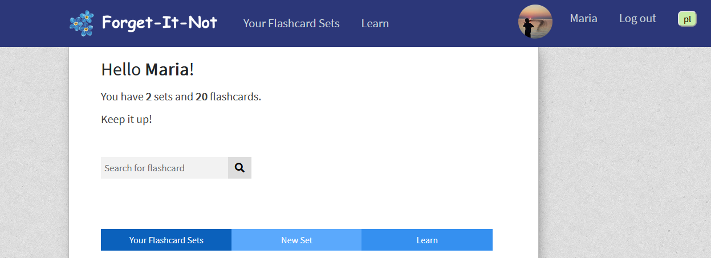
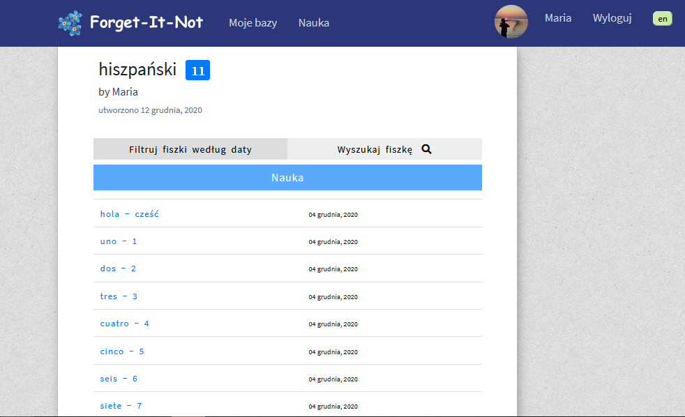

# Forget-It-Not
Simple django app for learning vocabulary by creating sets of flashcards and learning them.

## Table of contents
* [General info](#general-info)
* [Features](#features)
* [Technologies](#technologies)
* [Screenshots](#screenshots)
* [License and contact](#license-and-contact)

## General info
This is my first django app, its purpose for me was to learn django.

It is a simple application designed for learning languages and repeating new words.

## Features
* User registration with email confirmation
* Creating sets of flashcards (in question-answer format)
* Filtering flashcards by date
* Search bar to look for a specific flashcard 
* Learning all flashcards, flashcards from one set or from filtered part

## Technologies
* Python 3.8.0
* Django 3.0
* django-crispy-forms 1.8.1 
* Pillow  6.2.1
* six 1.15.0

## Screenshots

## License and contact
The project is licensed under the MIT License, see the [LICENSE.md](#./LICENSE.md) file for details.

Created by Agnieszka (contact.forget.it.not@gmail.com) - feel free to contact me!